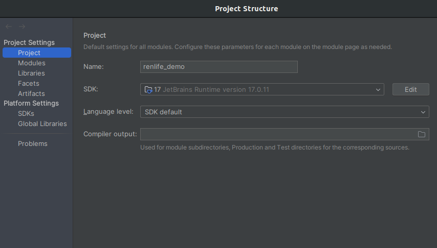
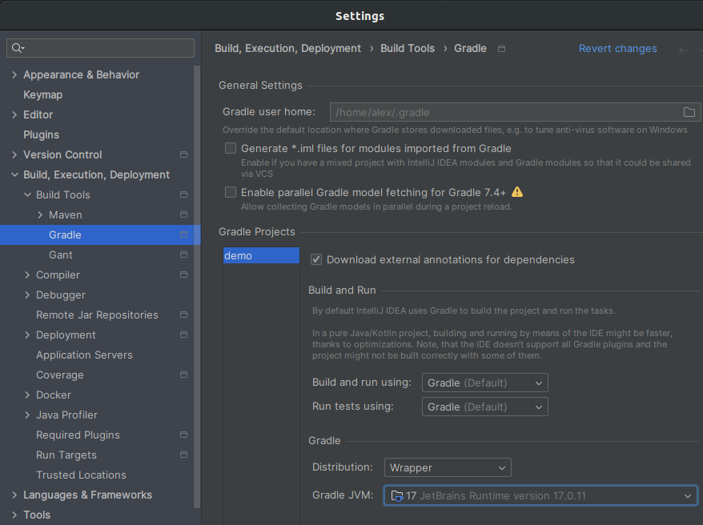

## Requirements
1. Java 17
2. Docker compose
3. Spring boot 3
4. Postgres
5. Liquibase

## IntelliJ IDEA

#### Specify project SDK version and gradle SDK version.

1. File -> Project Structure -> Project Settings -> Project -> SDK -> Java17
2. File -> Settings -> Build, Execution, Deployment -> Build Tools -> Gradle -> Distribution -> Wrapper
3. File -> Settings -> Build, Execution, Deployment -> Build Tools -> Gradle -> Gradle JVM -> Java17

## Start application
1. Docker compose up

        docker-compose up -d
2. Build application jar

        ./gradlew build -x test
3. Apply migrations

        ./gradlew update

## Test

1. Run tests
         
        ./gradlew test